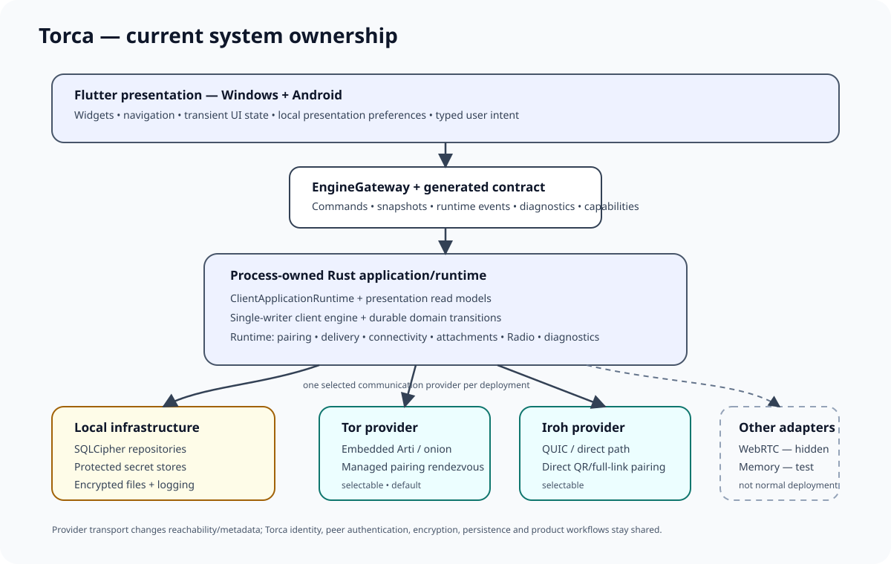

# Torca architecture

This document describes the current system boundaries in `main`. It is intentionally about ownership and data flow rather than individual classes, schema numbers or migration details. Source code, generated contracts and enforced repository policies are authoritative when they disagree with prose.

## System shape

Torca is one modular Rust application/runtime behind one responsive Flutter client. Windows and Android are platform hosts of the same product. A deployment selects exactly one communication provider; networking details are outside the product/domain model.



```text
Flutter presentation
    |
    | typed commands + presentation-safe DTOs
    v
EngineGateway / generated contract
    |
    v
process-owned torca-native runtime
    |
    +--> ClientApplicationRuntime / read models
    +--> single-writer client engine
    +--> background runtime / delivery / pairing / radio
    |
    v
application/domain ports
    |
    v
infrastructure + selected communication provider
    |
    +--> SQLCipher / protected secrets / encrypted files
    +--> Tor OR Iroh (normal selectable providers)
    +--> WebRTC (hidden until host bridges are complete)
```

## Non-negotiable ownership rule

**Flutter expresses user intent and renders application state. Rust owns durable product state and security/network policy.**

Flutter owns:

- widgets, navigation and responsive layout;
- transient interaction state such as focus, selection and open dialogs;
- local presentation preferences;
- platform-originated routing into shared navigation; and
- calls to `EngineGateway` using generated DTOs.

Rust owns:

- identity and contact relationships;
- domain identifiers and security-sensitive timestamps;
- pairing state, invitations and approval;
- message/receipt/attachment lifecycle;
- durable queues, retry, deduplication and conversation read models;
- contact verification and security projections;
- communication-provider selection/composition;
- peer authentication and cryptography;
- Radio Mode consent/session/floor/media-key state;
- encrypted persistence and protected-secret use;
- background lifecycle/power policy; and
- diagnostics/notification intent.

Platform code owns actual OS integration: app paths, protected secret stores, lifecycle, notifications, permissions, capture/window behavior and provider-specific host bridges where required.

## Layers

### Foundation — `crates/foundation`

Dependency-light primitives shared by the workspace: opaque identifiers, timestamps, cancellation, events and classified errors. Foundation does not own product workflows or infrastructure.

### Domains — `crates/domains`

Product vocabulary and invariants for identity, contacts, conversations, pairing, messaging, receipts, attachments, presence, notifications and Radio Mode. Domain crates do not know about Flutter, SQLite, networking stacks or OS APIs.

### Protocol — `crates/protocol`

Bounded/versioned representations for peer, pairing, relay, Radio and general wire concerns. Domain objects are not serialized directly merely because their fields look similar to a wire representation.

### Application — `crates/application`

Use cases, presentation facade, runtime coordination and the ports implemented by infrastructure.

Important boundaries include:

- `torca-client-application` — presentation-facing application commands, queries and projections;
- `torca-client-engine` — single-writer domain consistency boundary;
- `torca-runtime` — long-lived owner for network-facing/background work;
- `torca-transport-api` — provider-neutral transport identity, capabilities, lifecycle and peer byte-stream contracts;
- delivery/control-delivery, pairing, connectivity, bootstrap, diagnostics and Radio coordinator crates — focused modules of the client application.

Application crates depend inward on domain/protocol/foundation abstractions, not on concrete infrastructure implementations.

### Infrastructure — `crates/infrastructure`

Concrete adapters for application/domain ports:

- SQLCipher repositories and durable queues;
- cryptographic/protected-secret implementations;
- encrypted file and attachment stores;
- peer session/link and communication adapters;
- Tor rendezvous/transport and embedded Arti ownership;
- Iroh/QUIC transport and direct pairing bootstrap;
- WebRTC transport contract over host-negotiated DataChannels;
- deterministic memory transport for tests;
- logging and Radio media adapters.

### Platform — `crates/platform`

The outer composition and OS boundary.

- `torca-contract` maps application commands/read models to generated Rust/Dart DTOs.
- `torca-native` composes the real client and exposes the process-owned native runtime.
- platform crates own Windows/Android services and lifecycle behavior.

`torca-native` contains the **single communication-provider selection boundary**. Provider composition returns provider-neutral components: lifecycle, peer transport factory, pairing factory, optional rendezvous probe and Radio media factory.

## Startup and process ownership

Flutter starts `TorcaBootstrap` and loads local presentation preferences. The bootstrap opens an FFI-backed `EngineGateway`, initializes the native application/runtime and only then sends the `flutter_gateway_ready` lifecycle event. This decoded application response is the Flutter-level readiness boundary.

After the gateway is ready, Flutter attaches runtime-backed preference handlers, initializes deep-link routing, and installs platform-specific lifecycle/notification/desktop integrations. Startup failure is explicit and retryable; native-library incompatibility is surfaced rather than silently falling back to a fake implementation.

The native runtime is process-owned. UI routes and presentation handles may be recreated without creating independent Torca engines or parallel communication providers.

See [`docs/app-flows.md`](docs/app-flows.md) for the startup sequence diagram.

## Communication provider model

A deployment selects one `TransportKind`: Tor, Iroh, WebRTC or memory. Normal deployment currently exposes **Tor and Iroh**. WebRTC and memory remain hidden from the normal deploy selector.

The selected provider owns:

- how local communication becomes reachable;
- how a new pairing route is bootstrapped;
- how authenticated peer byte streams are created/accepted; and
- how Radio media reaches the peer when that capability is supported.

The provider does **not** own:

- Torca peer authentication/encryption;
- domain messages/receipts;
- durable delivery/retry;
- attachments;
- relationship/contact state;
- conversation persistence; or
- product UI.

The runtime never starts two providers concurrently for one session and never silently substitutes Tor when another provider was selected.

See [`docs/transport.md`](docs/transport.md).

## Tor composition

Tor uses embedded Arti and onion services. The Tor provider also uses the managed rendezvous service for pairing. Arti-specific ownership is isolated to Tor infrastructure/provider composition.

Established contact traffic does not use the pairing rendezvous service as a message mailbox; it uses authenticated peer sessions over the provider transport.

## Iroh composition

Iroh uses a persisted endpoint identity and QUIC. Pairing uses a direct bootstrap descriptor carried by QR/full-link invitations rather than requiring the managed Tor rendezvous service. The provider exposes messages, attachments, incoming sessions and Radio through the same application/runtime interfaces used by Tor.

Iroh is marked selectable/deployment-ready by the shared provider profile. This is an implementation/deployment gate, not a claim of equivalent privacy properties or equivalent real-device security validation to Tor.

## WebRTC and memory

The WebRTC adapter is present, but normal deployment hides it until Android/Windows host session and signaling bridges are complete. It consumes already negotiated reliable/ordered DataChannels; SDP/ICE/STUN/TURN signaling stays platform/provider-owned.

The memory adapter exists for deterministic/simulated runtimes and is not a production native provider.

## Pairing

Pairing establishes a durable relationship; the UI does not manufacture contact state from navigation events.

There are two product entry paths:

- **Join invitation** — the global add-contact action accepts provider-appropriate invitation material. Deep links use the same join modal as the Contacts flow.
- **Create invitation** — invitation creation belongs to the Invitations/pairing surface.

Provider bootstrap differs (managed session vs direct QR/signaling), but the encrypted pairing exchange, explicit approval and durable relationship completion remain shared application behavior.

Incoming creator-side decisions are surfaced as dismissible dialogs and guarded by a modal registry so the same pairing session is not presented twice.

## Messaging and read models

Conversation history is a bounded Rust query/paging surface, not a complete history copied into Flutter. UI search also delegates to the Rust history provider rather than filtering the root snapshot.

Outbound intent becomes durable local work before network delivery. Network failure does not make Flutter the retry owner. Inbound envelopes are validated, authenticated/decrypted, deduplicated and persisted before presentation projections update.

Receipts, attachments and Radio controls follow the same principle: durable or security-sensitive state transitions remain below the presentation boundary.

## Persistence and secrets

Structured state is stored through SQLCipher-backed repositories. SQL remains infrastructure-owned. Protected identity, storage, relationship and provider secrets are kept in OS-backed protected-secret namespaces rather than exposed as Flutter state.

Attachments are imported into application-controlled storage; explicit exports leave that boundary and are then governed by the user/OS/destination application.

## Radio Mode

Radio Mode is mutual-consent and half-duplex. Domain/application code owns consent, session/floor rules and key derivation. Infrastructure/provider code owns media I/O and transport. Platform code owns microphone permission and lifecycle integration.

The selected provider advertises whether Radio is available. Tor and Iroh currently advertise it; WebRTC/memory do not in the normal product capability profile.

## Connectivity, power and diagnostics

Local readiness and communication readiness are distinct. The client must remain able to render/use local encrypted state when a network provider is degraded.

Runtime work is demand/evidence/deadline driven rather than dependent on periodic Flutter polling. Durable work, network events, demand leases and executor deadlines wake background work.

Diagnostics and connectivity projections are intended to be payload-free/redacted operational data. Notification delivery uses a narrow event/cursor contract rather than handing OS notification code the entire application snapshot.

See [`docs/operations.md`](docs/operations.md).

## Deployable pieces

1. **Client** — Flutter + Rust application/runtime for Windows or Android.
2. **Managed rendezvous service** — used by the Tor pairing provider. It is ephemeral/untrusted and is not the source of truth for conversations.

Direct providers such as Iroh do not require the managed rendezvous service merely because Tor does.

## Enforced boundaries

Repository source/architecture policy scripts check important rules including inward dependency direction, contract ownership, SQL boundaries, Arti isolation, platform conditionals and Flutter/native access boundaries. These checks run in CI together with Rust/Flutter/contract validation.

If a feature requires violating a rule, change the architecture intentionally and update policy plus documentation. Do not add a silent exception and leave the prose describing a boundary that no longer exists.

## Documentation update rule

Update this page when ownership, dependency direction, process boundaries, provider selection or trust boundaries change. Exact DTO fields, timeout values, migration counts and implementation checkpoints belong in source/tests/history rather than this overview.