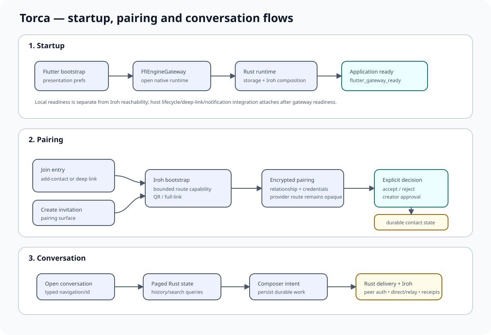
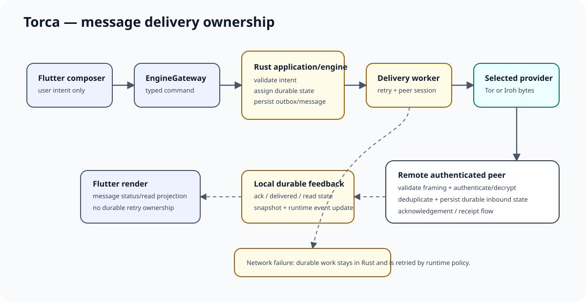

# Application flows

This page describes the current product/runtime journeys as ownership flows. Exact DTO fields and screen implementation details remain source contracts.



## Startup

```text
Flutter process starts
  -> load local presentation preferences
  -> open FfiEngineGateway
  -> initialize process-owned Rust runtime
  -> select/compose deployment communication provider
  -> build first application projection
  -> Flutter decodes successful initialization
  -> send lifecycle: flutter_gateway_ready
  -> attach deep links + platform lifecycle/notifications/desktop services
  -> render HomeScreen
```

`flutter_gateway_ready` is the application-level readiness boundary used by the client host. A provider may still report degraded network reachability after local state is ready.

If initialization fails, the bootstrap shows a retryable startup surface. Native library/build mismatches are surfaced explicitly; the app does not silently replace the native runtime with an in-memory business implementation.

## Join an invitation

The Contacts/global add-contact action and a pairing deep link converge on the same join composer.

```text
user opens add contact OR app receives pairing link
  -> shared join invitation modal
  -> parse provider invitation/bootstrap material
  -> application starts/join pairing session
  -> provider establishes rendezvous/direct bootstrap
  -> encrypted pairing exchange
  -> creator receives approval decision surface
  -> explicit approval/rejection
  -> relationship/contact persisted
  -> snapshots update
  -> UI shows contact-added feedback
```

Provider bootstrap differs:

- Tor uses the managed rendezvous session and can support short code, QR and full-link input.
- Iroh uses direct bootstrap material and advertises QR/full-link rather than short-code-only pairing.

The UI does not infer pairing completion merely because a screen closed; the durable contact comes from Rust state.

## Create an invitation

Invitation creation belongs to the Invitations/pairing surface rather than the global join action.

```text
user chooses create invitation
  -> application creates pairing session
  -> selected provider creates commissioning/bootstrap state
  -> UI renders QR/link/capabilities supported by provider
  -> remote joins
  -> creator is prompted for explicit decision
  -> accept -> durable contact
  -> reject/cancel/expire -> no relationship
```

Incoming creator decisions are presented through one modal registry so the same pairing session is not opened twice when snapshots/navigation/platform events race.

## Open a conversation

Home/navigation requests carry a conversation identifier. `TorcaApp` resolves the identifier against the current projection, then pushes `ConversationScreen`.

Conversation history is loaded through a paged Rust query. Search is also a Rust query. Flutter does not own or locally filter the complete durable message history.

## Send a message



```text
composer user intent
  -> typed bridge command
  -> Rust application/engine validates and persists outbound state
  -> durable delivery worker chooses selected provider peer transport
  -> authenticated peer session + application-layer encryption
  -> provider byte stream
  -> remote validates/decrypts/deduplicates/persists
  -> acknowledgement/receipt state returns
  -> local snapshots/events update
  -> Flutter renders status
```

A network error leaves retry ownership in Rust. Flutter never becomes the durable outbox.

## Read receipts

Read-receipt preference is synchronized with the runtime. When enabled, application-owned read state produces durable/control delivery as required by the protocol. UI widgets render the resulting message/read projection.

## Attachments

```text
user selects source file
  -> Flutter supplies explicit user intent/path
  -> Rust validates limits and imports/manages application-controlled state
  -> encrypted/resumable transfer follows paired peer boundary
  -> progress/cancel/resume are runtime-owned
  -> recipient persists transfer state
  -> explicit open/export action creates user-visible output
```

Capabilities and limits come from the runtime/build contract rather than hard-coded UI assumptions.

## Radio Mode

Radio Mode is mutual-consent and half-duplex.

```text
user enables/accepts Radio with contact
  -> application owns consent/session state
  -> platform grants microphone permission before capture
  -> application owns floor/burst rules and session key derivation
  -> provider-owned Radio media factory carries encrypted media
  -> release/background/session close stops transmission
```

The selected provider advertises Radio support. Tor and Iroh currently do; WebRTC/memory do not in the normal provider feature profile.

## Notifications and deep links

Runtime events are exposed through a narrow event stream/cursor contract. Android notification routing and deep-link routing translate platform-originated interactions into the same application navigation requests used inside the app. Platform code does not become a second message/contact store.

## Settings

Local presentation settings remain in Flutter preferences where appropriate. Settings that affect runtime/security behavior (notifications, read receipts, audio devices, battery/background policy) are synchronized through runtime commands; Flutter then reconciles with the authoritative runtime projection.

## Diagnostics

The diagnostics screen and deployer request structured runtime diagnostics/log tails from `EngineGateway`/native tooling. Diagnostics should remain operational/redacted and must not become a route for message/attachment plaintext, Radio audio, private keys or relationship secrets.

See [`operations.md`](operations.md) for collection and recovery workflow.